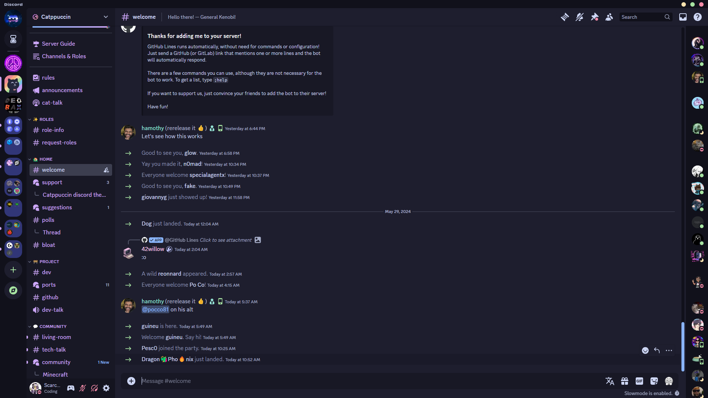

<h3 align="center">
	 
	
	-Dark Catppuccin for <a href="https://discord.com/">Discord</a>
	
</h3>

## Previews

🌺 Macchiato

🌿 Mocha

## Usage

### [BetterDiscord](https://betterdiscord.app) or [Vencord](https://vencord.dev/)

1. Download your preferred flavour:

- 🌺 [Macchiato](./themes/-Dark-macchiato.theme.css?raw=1)
- 🌿 [Mocha](./themes/-Dark-mocha.theme.css?raw=1)

2. Copy the downloaded file to your BetterDiscord/Vencord themes folder.
3. Enable the theme in BetterDiscord/Vencord settings.

## 🙋 FAQ

- Q: **_"Can this get my account banned?"_**
- A: Using third party clients and injecting custom css is against the ToS. While nobody has ever been banned for simply using discord client mods, We are not responsible for anything that might happen to your account by using third party clients. Use at your own discretion!

## 💝 Thanks to these people for the original project

- [GlowingUmbreon](https://github.com/glowingumbreon)
- [Isabelinc](https://github.com/Isabelincorp)
- [Ren](https://github.com/watatomo)
- [winston](https://github.com/nekowinston)
- [rubyowo](https://github.com/rubyowo)
- [Aven](https://github.com/ToxicAven)

&nbsp;

Copyright &copy; 2021-present <a href="https://github.com/catppuccin" target="_blank">Catppuccin Org</a>

